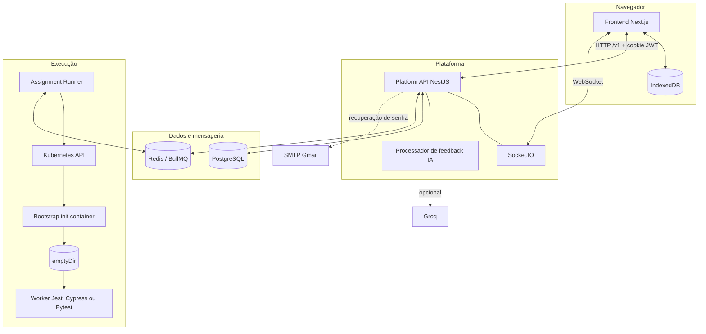

# Arquitetura

O EEVEE possui três componentes de aplicação. O frontend atende estudantes e administradores, a Platform API concentra domínio e persistência, o Assignment Runner executa código de forma isolada no Kubernetes. Redis desacopla os dois serviços e PostgreSQL mantém o estado durável.

## Componentes

## Frontend

O diretório `front/` contém uma aplicação Next.js. Ela usa Axios para a API, TanStack Query para estado remoto, Monaco como editor e Socket.IO para acompanhar execuções.

Os arquivos do workspace permanecem no IndexedDB, separados por usuário e atividade. Editar um arquivo não o persiste automaticamente na Platform API, ele é enviado quando uma tentativa ou prévia é iniciada.

## Platform API

O processo de `platform-api/`:

- autentica por JWT em cookie;
- aplica validação, CORS e limitação de requisições;
- administra usuários, turmas, atividades, templates, gabaritos e provas;
- persiste tentativas, previews e respostas de pesquisa;
- prepara payloads e publica execuções no BullMQ;
- consome eventos do Assignment Runner e atualiza PostgreSQL e Socket.IO;
- processa `ai-report-queue`, com concorrência 10, quando o feedback da Groq está configurado;
- envia e-mails de recuperação de senha quando o SMTP está configurado.

O versionamento por URI usa `v1`, com rotas como `/v1/auth/login`. O Swagger é servido em `/api`.

## Filas e contratos

Os contratos em `packages/execution-contracts/` definem três filas:

| Fila | Direção | Finalidade |
| --- | --- | --- |
| `execution-commands` | Platform API → Runner | Tentativas e previews assíncronos. |
| `execution-results` | Runner → Platform API | Eventos de início, conclusão e falha. |
| `execution-requests` | Platform API ↔ Runner | Execução com espera pela resposta e cancelamento. |

O Runner processa comandos e requisições com concorrência 5 em cada consumidor. Os eventos de ciclo de vida são `execution.started.v1`, `execution.completed.v1` e `execution.failed.v1`.

## Assignment Runner e workers

Cada tipo de executor possui uma estratégia que define imagem, arquivos, comando de teste e serviços auxiliares. Um Kubernetes Job normalmente contém:

1. um init container de bootstrap, que recebe a definição e escreve os arquivos;
2. um volume `emptyDir` compartilhado;
3. o contêiner principal do executor;
4. contêineres auxiliares, como PostgreSQL, quando necessários.

O Job usa `restartPolicy: Never` e `backoffLimit: 0`. O Runner acompanha seu estado, coleta os logs do contêiner principal, calcula o resultado e publica o evento correspondente no Redis.

Veja a sequência completa em [Fluxo de execução](execution-flow.md).

