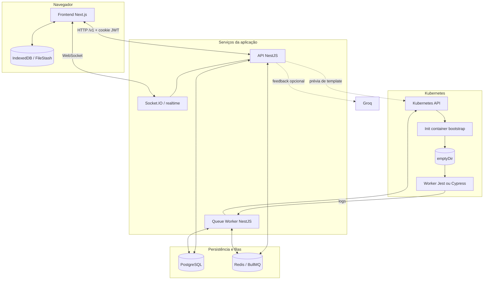

# Arquitetura

O EEVEE combina uma aplicação web, uma API, processos assíncronos e executores efêmeros. O frontend e a API atendem as interações, Redis desacopla a submissão da execução, PostgreSQL preserva o estado e Kubernetes cria um ambiente por execução.

## Componentes

## Frontend

O diretório `front/` contém uma aplicação Next.js. Ela oferece as áreas de estudante e administração, usa Axios para a API, TanStack Query para estado remoto, Monaco como editor e Socket.IO para eventos de execução.

O workspace mantém sua árvore de arquivos em IndexedDB por usuário e atividade. Portanto, editar um arquivo não implica persistência imediata no backend.

## API HTTP

O processo iniciado por `npm run start:dev` expõe a API NestJS. Ele:

- autentica usuários com JWT em cookie;
- aplica validação, CORS e throttling;
- administra entidades educacionais;
- persiste tentativas e previews;
- publica jobs BullMQ;
- fornece o gateway Socket.IO;
- executa diretamente a prévia administrativa de templates.

O versionamento por URI está habilitado com versão padrão `v1`, resultando em rotas como `/v1/auth/login`. O Swagger é servido em `/api`, fora desse prefixo.

## Consumidor de filas

`npm run start:worker:dev` inicia outra aplicação NestJS, sem servidor HTTP. Ela consome:

- `scheduling-queue`, para tentativas;
- `preview-queue`, para execuções prévias;
- `ai-report-queue`, para feedback refinado.

As concorrências configuradas são 5, 5 e 10, respectivamente.

## Workers

São definidos por um conjunto de containers efêmeros, cada um com uma imagem Docker específica, que são utilizados para a execução dos testes automatizados.

Eles são criados pelo kubernetes Job, que é gerenciado pelo consumidor de filas. Cada worker é isolado, garantindo que a execução de um teste não afete outros processos.

## Execução de código

Cada tipo de worker possui uma estratégia que determina imagem, diretórios, testes e serviços auxiliares. O Kubernetes Job normalmente contém:

1. um init container `worker-bootstrap`, que recebe a definição em Base64 e escreve arquivos;
2. um volume `emptyDir` compartilhado;
3. o contêiner principal do executor;
4. quando necessário, um contêiner PostgreSQL auxiliar.

O Job possui `restartPolicy: Never`, `backoffLimit: 0` e não monta automaticamente o token da service account. O processo aguarda o estado do Job e obtém os logs do contêiner principal.

## Fluxo de dados

Arquivos submetidos são persistidos em `Attempt.receivedWork` como JSONB. Templates e parâmetros vêm do PostgreSQL. O consumidor combina esses dados, cria o Job e interpreta sua saída. Nota, contagens e relatórios retornam ao PostgreSQL; atualizações de progresso podem ser emitidas por Socket.IO.

Para os detalhes de cada transição, consulte [Fluxo de execução](execution-flow.md).

