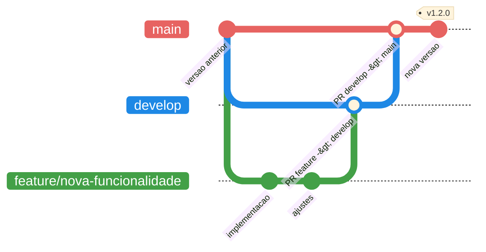

# Como contribuir

Qualquer pessoa pode ajudar a melhorar o EEVEE. Estudantes e professores podem relatar problemas, sugerir melhorias e apontar dificuldades na documentação. Pessoas desenvolvedoras também podem corrigir esses problemas e implementar novas funcionalidades.

## Escolha como participar

| Forma de contribuição | Quando usar | Próximo passo |
| --- | --- | --- |
| Relatar um problema | Quando algo não funcionar como esperado ou uma mensagem não estiver clara. | [Abrir o formulário de bug](https://github.com/COCSI-MG/eevee/issues/new?template=bug_report.yaml). |
| Sugerir uma melhoria | Para propor uma funcionalidade ou uma mudança no fluxo de uso. | [Abrir uma solicitação de funcionalidade](https://github.com/COCSI-MG/eevee/issues/new?template=feature_request.yaml). |
| Melhorar a documentação | Para corrigir informações, exemplos, imagens, ortografia ou instruções. | Registre a sugestão como melhoria ou [envie uma alteração](#contribuir-com-codigo). |
| Contribuir com código | Para corrigir bugs ou implementar mudanças no projeto. | Consulte o [fluxo técnico](#contribuir-com-codigo). |

## Contribuições sem código

Antes de registrar uma contribuição, consulte as [issues existentes](https://github.com/COCSI-MG/eevee/issues) para verificar se o assunto já está sendo discutido.

Ao relatar um problema, informe:

- O que você estava tentando fazer;
- O resultado esperado e o que aconteceu de fato;
- Os passos necessários para reproduzir o comportamento;
- O navegador utilizado;
- Mensagens de erro relevantes;
- Uma captura de tela, quando ela ajudar a demonstrar o problema.

Ao sugerir uma melhoria, descreva primeiro o problema observado e quem seria beneficiado. Uma proposta não precisa incluir detalhes técnicos de implementação.

!!! warning "Proteja dados pessoais"
    Não publique senhas, tokens, informações acadêmicas, soluções de estudantes ou outros dados pessoais. Remova ou oculte esses conteúdos de logs e capturas de tela antes de anexá-los.

## Contribuir com código

Contribuições com código seguem o fluxo de branches e Pull Requests do projeto. Antes de alterar o repositório, prepare o ambiente e identifique os componentes afetados.

### Preparar o ambiente

Siga [Ambiente local e Docker](local-development.md) e inicie Platform API, Assignment Runner, frontend, PostgreSQL, Redis e Minikube. Para mudanças que não executam soluções, ainda é possível trabalhar em partes isoladas, mas o fluxo ponta a ponta depende de todos esses componentes.

### Antes de alterar

1. Identifique se a mudança pertence ao frontend, domínio, scheduling, estratégia de worker ou infraestrutura;
2. Preserve os contratos `/v1` consumidos pelo frontend;
3. Adicione migrations para alterações de entidades ou enums;
4. Considere segurança e isolamento em qualquer mudança de executor;
5. Crie uma branch específica para a alteração antes de iniciar o desenvolvimento.

### Fluxo de branches

O desenvolvimento segue um fluxo baseado em GitFlow, mantendo a implementação de funcionalidades separada das branches compartilhadas do projeto.

O fluxo principal é:

```text
feature/nome-da-funcionalidade
        ↓
     develop
        ↓
    tag vX.Y.Z
        ↓
       main
```

As principais branches são:

* `main`: contém as versões estáveis do sistema;
* `develop`: concentra as funcionalidades e correções que já foram revisadas e integradas;
* `feature/*`: utilizadas para desenvolver novas funcionalidades e melhorias.

Uma nova funcionalidade deve partir da `develop`:

```bash
git checkout develop
git pull
git checkout -b feature/nome-da-funcionalidade
```

Após o desenvolvimento, deve ser aberta uma Pull Request:

```text
feature/nome-da-funcionalidade
        ↓
   Pull Request
        ↓
     develop
```

Depois que as alterações previstas para uma nova versão estiverem disponíveis em `develop`, é realizada a integração para `main`:

```text
develop
   ↓
Pull Request
   ↓
tag
   ↓
main
```

O fluxo completo pode ser representado como:



Assim, alterações não são enviadas diretamente para `main`. O caminho esperado para uma funcionalidade é sempre:

**`feature/*` → `develop` → `tag` → `main`**.

### Pull Requests

Toda alteração destinada às branches compartilhadas deve ser submetida por meio de uma **Pull Request (PR)**.

Todo pull request deve ser revisado por outro desenvolvedor do projeto. A revisão de código é obrigatória para alterações em `develop` e `main`. A revisão deve ser feita por alguém que não seja o autor da PR.

Deve-se descrever o pr de forma detalhada do que foi feito e qual o objetivo dessa implementação. A descrição deve ser clara e objetiva, para que o revisor consiga entender o que foi feito e qual o objetivo da mudança. Caso necessário inclua prints ou gifs para ilustrar o funcionamento da mudança.

Antes de abrir uma PR:

1. Certifique-se de que a branch está atualizada com sua branch de origem;
2. Execute os testes e builds relacionados à alteração;
3. Remova código temporário, logs e arquivos que não devem ser versionados;
4. Verifique se novas entidades ou enums possuem migrations;
5. Atualize a documentação quando houver mudança de comportamento, configuração ou arquitetura.

O título da PR deve indicar de forma objetiva o propósito da mudança. Exemplos:

```text
feat: adiciona worker para Go
fix: corrige cálculo da pontuação das tentativas
docs: documenta criação de atividades
refactor: separa estratégia de execução do worker
```

A descrição deve explicar, quando aplicável:

* Qual problema está sendo resolvido;
* Qual solução foi implementada;
* Quais componentes foram alterados;
* como validar a mudança;
* Se existem migrations ou alterações de infraestrutura;
* Se há algum impacto conhecido ou incompatibilidade.

Uma PR deve permanecer pequena o suficiente para ser revisada de forma objetiva. Alterações independentes devem, sempre que possível, ser separadas em PRs diferentes.

Após a abertura da PR, a esteira esperada é:

```text
Branch
  ↓
Pull Request
  ↓
Build
  ↓
Testes automatizados
  ↓
Revisão de código
  ↓
Correções, se necessárias
  ↓
Aprovação
  ↓
Merge
```

Uma PR só deve ser integrada quando as validações automatizadas estiverem concluídas e as observações relevantes da revisão tiverem sido resolvidas.

### Validação mínima

Contratos compartilhados:

```bash
cd packages/execution-contracts
npm run build
```

Platform API:

```bash
cd platform-api
npm run test
npm run build
```

Assignment Runner:

```bash
cd assignment-runner
npm run test
npm run build
```

Frontend:

```bash
cd front
npm run build
```

Mudanças relacionadas à execução de código também devem ser validadas no ambiente com Kubernetes e com as imagens de worker correspondentes.

### Adicionar um executor

Uma adição completa exige mudanças coordenadas:

1. Adicionar o valor aos enums da Platform API e do Assignment Runner;
2. Implementar e registrar a estratégia em `assignment-runner/`;
3. Criar a imagem correspondente em `images/`;
4. Criar migration para os enums PostgreSQL de atividade e template;
5. Espelhar o enum e suas opções no frontend;
6. Atualizar Makefile e variáveis de imagem do Helm/Runner, quando aplicável;
7. Construir e carregar a imagem no cluster;
8. Testar template, preview, submissão, cancelamento e parser do resultado;
9. Documentar arquivos obrigatórios, framework de testes, rede e credenciais.

### Alterar templates ou correção

Mantenha compatibilidade entre `WorkerType`, caminhos montados e imports normalizados. Cubra, no mínimo:

* Zero testes e falha de preparação;
* Todos os testes aprovados;
* Erro do framework;
* Timeout e falha do Kubernetes;
* Dependência indisponível;
* Concorrência de tentativas.
