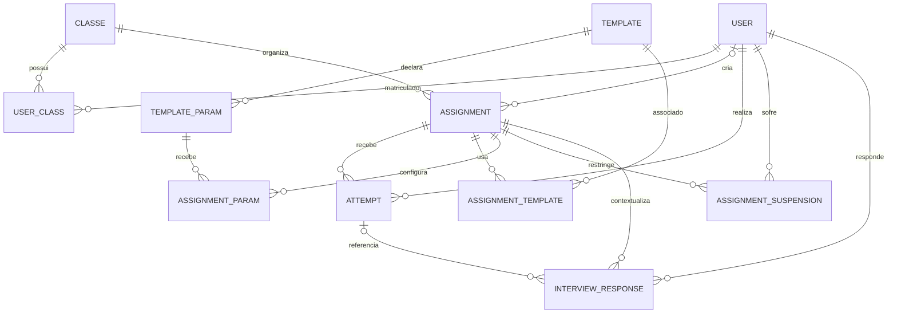

# Banco de dados

O backend usa PostgreSQL por TypeORM. A configuração atual habilita `synchronize: true` e também fornece migrations em `scheduler-api/src/migrations`.

## Modelo principal

## Entidades educacionais

### `User`

Armazena e-mail único, nome, papel administrativo e hash da senha. Relaciona-se com turmas, tentativas, suspensões e atividades criadas. O hash é excluído das transformações de resposta por `class-transformer`.

### `Class` e `UserClass`

`Class` armazena nome e descrição. `UserClass` representa a matrícula e possui índice único para `(userId, classId)`. A turma não possui professor proprietário.

### `Assignment`

Representa a atividade: turma, criador opcional, título, descrição, máximo de tentativas, executor, boilerplate, SQL inicial e configuração opcional de questionário.

### `Template`

Guarda título, descrição, conteúdo de teste, executor e dependências.

`TemplateParam` define nome e tipo. `AssignmentTemplate` realiza a relação muitos-para-muitos. `AssignmentParam` guarda o valor de um parâmetro para uma atividade.

## Execução e correção

### `Attempt`

Armazena número sequencial por usuário/atividade, estado, aceitação, pontuação, aprovados, falhas, arquivos recebidos em JSONB, relatório bruto, feedback refinado e data de criação.

### `SchedulingPreviewRun`

Registra preview por usuário e atividade, com estado, nome do Job, pontuação, contagens, relatório, erro e timestamps. É separado de `Attempt` para não consumir tentativas.

### `AssignmentUserSuspension`

Registra uma suspensão única por usuário e atividade, com motivo e data.

## Pesquisa

`InterviewResponse` possui índice único por usuário/atividade. Pode referenciar uma tentativa e armazena escalas de 1 a 5, respostas abertas e perguntas adicionais em JSONB.

## Salvamento de arquivos

`FileEntry` descreve arquivo, caminho temporário, tamanho, MIME, estado e usuário/atividade. `SyncJob` representa operações de upload/download/delete/sync.

## Persistência externa ao PostgreSQL

- arquivos do workspace: IndexedDB do navegador;
- upload selecionado: diretório local `uploads/assignment-<id>/user-<id>/` da API;
- filas: Redis;
- arquivos de cada execução: `emptyDir` efêmero no pod;
- logs consolidados: campo `Attempt.report` ou `SchedulingPreviewRun.report`.
