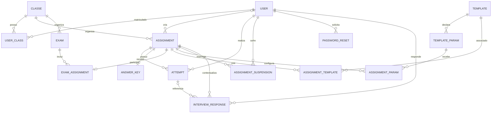

# Banco de dados

A Platform API usa PostgreSQL por TypeORM. Migrations em `platform-api/src/migrations/` continuam necessárias para evolução controlada do banco, especialmente em produção.

## Modelo principal

## Usuários e acesso

### `User`

Armazena e-mail, nome, papel administrativo, hash da senha e `deletedAt`. A exclusão é lógica, o índice parcial de e-mail considera apenas usuários ativos, permitindo preservar o histórico sem impedir uma conta futura com o mesmo endereço.

### `PasswordReset`

Registra o hash do token, expiração e `usedAt`. O token enviado ao usuário não é persistido em texto puro e só pode ser usado uma vez.

### `Class` e `UserClass`

`Class` guarda nome e descrição. `UserClass` representa a matrícula e possui unicidade para `(userId, classId)`. A turma não possui um professor proprietário exclusivo.

## Atividades, gabaritos e provas

### `Assignment`

Representa a atividade: turma, criador opcional, título, descrição, máximo de tentativas, executor, boilerplate, SQL inicial e configuração opcional de questionário. Relaciona-se também ao gabarito e, no máximo, a uma prova.

### `AnswerKey`

Mantém um gabarito por atividade. Seu conteúdo é armazenado em JSONB como uma árvore de arquivos que pode ser aberta no workspace do estudante quando a atividade permite sua visualização.

### `Exam` e `ExamAssignment`

`Exam` pertence a uma turma e armazena título, descrição, data de início e prazo. `ExamAssignment` liga atividades à prova e guarda os pontos de cada questão. `assignmentId` é único nessa associação: uma atividade não participa de duas provas ao mesmo tempo.

### Templates e parâmetros

`Template` guarda título, descrição, conteúdo de teste, executor e dependências. `TemplateParam` define nome e tipo, `AssignmentTemplate` relaciona atividade e template, `AssignmentParam` guarda o valor do parâmetro para a atividade.

## Execução e correção

### `Attempt`

Armazena número sequencial por usuário e atividade, estado, aceitação, pontuação, aprovados, falhas, arquivos recebidos em JSONB, relatório bruto, feedback refinado e data de criação.

### `SchedulingPreviewRun`

Registra previews sem consumir tentativas, com estado, nome do Job, pontuação, contagens, relatório, erro e timestamps.

### `AssignmentUserSuspension`

Registra uma suspensão única por usuário e atividade, com motivo e data.

## Pesquisa e arquivos

`InterviewResponse` possui unicidade por usuário e atividade, pode referenciar uma tentativa e armazena escalas, respostas abertas e perguntas adicionais em JSONB.

`FileEntry` descreve arquivo, caminho temporário, tamanho, MIME, estado e usuário/atividade. `SyncJob` representa operações de upload, download, exclusão e sincronização.

## Persistência fora do PostgreSQL

- Arquivos do workspace: IndexedDB do navegador;
- Upload selecionado: armazenamento local da Platform API;
- Filas e eventos de execução: Redis;
- Arquivos de cada execução: `emptyDir` efêmero no pod;
- Logs consolidados: `Attempt.report` ou `SchedulingPreviewRun.report`.
