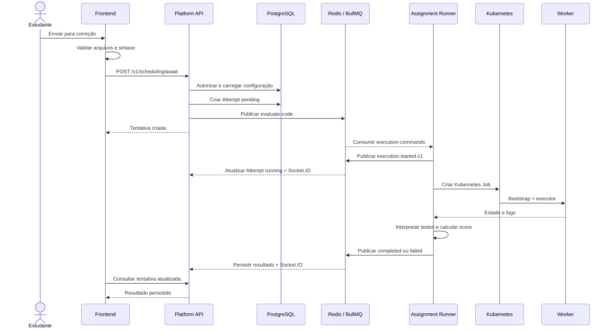

# Fluxo de execução

Esta página descreve o caminho de **Enviar para correção**, do navegador até a nota persistida.

## Sequência principal



## 1. Requisição e autorização

O frontend envia a atividade e o mapa de arquivos no formato caminho-conteúdo. A Platform API autentica o usuário, verifica seu acesso à atividade, impede conflitos de execução e aplica o limite de tentativas.

O payload completo do worker é preparado antes do registro da tentativa. Em seguida, a API cria um `Attempt` com estado `pending`, arquivos recebidos e nota inicial zero, e publica um comando `evaluate-code` em `execution-commands`.

## 2. Início no Runner

O Assignment Runner consome o comando com concorrência 5. Antes de criar o Job, publica `execution.started.v1`. A Platform API consome esse evento, marca a tentativa como `running` e avisa o frontend por Socket.IO.

Os contratos identificam se o destino é uma tentativa ou uma prévia. Assim, o Runner não precisa acessar as entidades educacionais nem o PostgreSQL da plataforma.

## 3. Preparação do Kubernetes Job

O payload já contém arquivos da solução, testes, dependências, parâmetros, boilerplate e SQL inicial aplicáveis. A estratégia do executor transforma isso em um Job:

1. O bootstrap escreve solução e testes no `emptyDir`;
2. O contêiner principal monta esse volume;
3. O executor instala dependências e roda seu framework;
4. Variantes PostgreSQL inicializam também o serviço auxiliar e seus dados.

Os Jobs são isolados por execução. Seus arquivos e contêineres são efêmeros.

## 4. Resultado e persistência

O Runner acompanha o Job, lê os logs e extrai testes aprovados e reprovados. A pontuação é calculada por:

```text
score = passes / (passes + failures || 1)
isAcceptable = score >= 0.7
```

Na conclusão, publica `execution.completed.v1`, falhas de preparação, infraestrutura ou framework geram `execution.failed.v1`. A Platform API persiste estado, pontuação, contagens e relatório, e emite a atualização por Socket.IO.

## 5. Recuperação de execuções presas

A cada cinco minutos, a Platform API procura tentativas `pending`, `enqueded` ou `running` com mais de dez minutos e as marca como falhas. Essa recuperação corrige o estado persistido, mas não garante o encerramento de um Kubernetes Job que ainda exista.

## Previews e teste de template

A prévia do estudante cria um `SchedulingPreviewRun`, sem consumir tentativa. Ela usa `execution-commands`, possui estado próprio e pode ser cancelada, o cancelamento é enviado ao Runner por `execution-requests`.

O teste administrativo de template usa `execution-requests`: a Platform API envia a requisição e aguarda a resposta do Runner. Esse teste não cria tentativa e não salva automaticamente o template.
