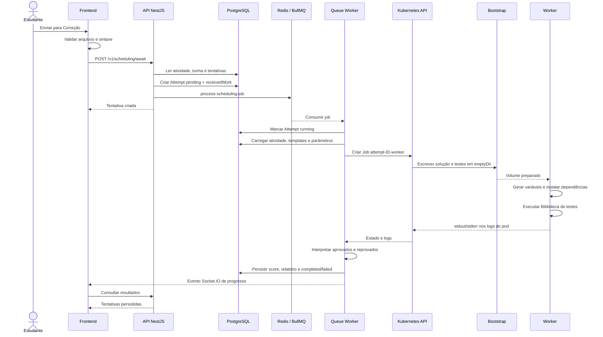

# Fluxo de execução

Esta página descreve o caminho principal usado por **Enviar para Correção**, do navegador até a persistência do resultado.

## Sequência principal



## 1. Requisição inicial

O frontend envia `POST /v1/scheduling/await` com o identificador da atividade e um mapa `files` no formato caminho-conteúdo. `applicationFileContent` permanece por compatibilidade com fluxos anteriores.

Antes da chamada, o frontend verifica a estrutura mínima esperada para o executor e tenta transpilar arquivos relevantes. A API aplica o `JwtAuthGuard`, o limite de 30 requisições por minuto e o `ValidationPipe` global.

## 2. Autorização e tentativa

`SchedulingController.createAsync` chama `SchedulingService.createSchedulingJobAsync`. O serviço:

1. carrega a atividade por `AssignmentService.findOne`, que restringe o acesso do estudante às suas turmas;
2. verifica se há tentativa em execução;
3. conta as tentativas existentes;
4. aplica `maxAttempts`;
5. cria `Attempt` com estado `pending`, nota zero e `receivedWork`;
6. adiciona `process-scheduling-job` à `scheduling-queue`.

A checagem impede estado `running`, mas não bloqueia explicitamente outra tentativa ainda `pending`.

## 3. Consumo assíncrono

O processo iniciado por `start:worker:dev` consome a mensagem. Se a tentativa não estiver em `pending`, ela não é processada. Caso contrário, o estado muda para `running` e o serviço prepara o worker.

Um cron executado a cada cinco minutos marca como falhas tentativas `pending`, `enqueded` ou `running` com mais de dez minutos. Essa rotina atualiza o banco, mas não encerra o Kubernetes Job associado.

## 4. Preparação

`SchedulingWorkerPreparationService` exige ao menos um template. Ele carrega:

- executor da atividade;
- arquivos do estudante;
- conteúdo de cada template;
- dependências npm;
- valores e tipos de parâmetros;
- boilerplate e SQL inicial quando aplicáveis.

Os templates viram arquivos numerados de teste. O backend ajusta imports relativos e gera `template-variables.ts`. Depois, `WorkerPayloadBuilderService` cria o payload final para a estratégia do executor.

## 5. Kubernetes Job

`WorkerService.createWorkerWithInitContainer` serializa a definição como JSON/Base64 e monta as opções do Job. Para uma tentativa de ID 42, o nome é `attempt-42-worker`.

O bootstrap escreve primeiro os arquivos da solução e depois os arquivos de teste no `emptyDir`. O contêiner principal monta o mesmo volume, instala as dependências informadas e executa o gatilho da imagem.

Executores PostgreSQL adicionam um contêiner auxiliar e executam o script inicial.

## 6. Espera, stdout e stderr

`KubernetesService` consulta o estado a cada dois segundos, por até 100 repetições, aproximadamente 200 segundos. Não há `activeDeadlineSeconds` no Job. Ao terminar, o serviço encontra o primeiro pod e busca os logs do contêiner principal, removendo sequências ANSI.

As imagens worker executam os frameworks por processos filhos. A saída de testes e erros é encaminhada aos logs do pod. O backend não persiste stdout e stderr em campos separados; o texto consolidado vira `report`.

## 7. Interpretação

Para Jest, o parser procura a linha `Tests:` e extrai `passed` e `total`. Falhas são `total - passed`. Para Cypress, procura `Passing:` e `Failing:`; se não encontrar, usa o parser Jest como fallback.

```text
score = passes / (passes + failures || 1)
isAcceptable = score >= 0.7
```

O consumidor persiste `completed`, contagens, pontuação, aceite e relatório. Erros de preparação ou infraestrutura persistem `failed`, nota zero e mensagem de erro.

## Execução prévia

`POST /v1/scheduling/preview` cria um `SchedulingPreviewRun`, não um `Attempt`. O job recebe ID próprio, pode ser cancelado por `DELETE /v1/scheduling/preview/:id` e usa o mesmo preparo e executor. Apenas uma prévia pendente/em execução é reutilizada por usuário e atividade.
