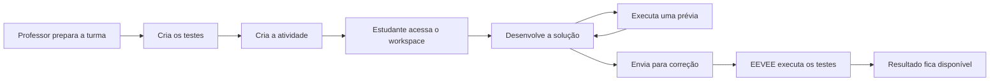

# Como o EEVEE funciona

O EEVEE conecta atividades de programação, testes automatizados e tentativas dos estudantes. O professor prepara a atividade e seus critérios de correção; o estudante desenvolve a solução no navegador e recebe o resultado após o envio.

## Fluxo geral

## Conceitos principais

| Conceito | O que representa |
| --- | --- |
| Turma | Agrupa estudantes e atividades. |
| Atividade | Exercício de programação com enunciado, código inicial e limite de tentativas. |
| Template de teste | Teste automatizado reutilizável preparado pelo professor. |
| Workspace | Ambiente no navegador em que o estudante edita os arquivos. |
| Prévia | Execução usada durante o desenvolvimento, sem consumir uma tentativa. |
| Tentativa | Envio registrado para correção e incluído no limite da atividade. |
| Resultado | Pontuação, testes aprovados, testes reprovados e relatório da execução. |

## Preparação da atividade

O professor cria uma turma, seleciona os estudantes e prepara os templates de teste. Depois, cria uma atividade informando seu enunciado, código inicial, executor e número máximo de tentativas.

Os templates definem os comportamentos que serão verificados quando o estudante executar ou enviar a solução.

## Desenvolvimento da solução

O estudante abre a atividade no workspace e trabalha sobre os arquivos fornecidos pelo professor. O conteúdo é mantido no navegador durante o desenvolvimento.

Antes do envio, o EEVEE verifica a estrutura básica dos arquivos e alguns erros de sintaxe. Essa verificação ajuda a encontrar problemas antecipadamente, mas não substitui os testes executados pelo sistema.

## Prévia e correção

| Ação | Resultado | Consome tentativa? |
| --- | --- | --- |
| **Executar** | Executa uma prévia e apresenta o relatório no workspace. | Não |
| **Enviar para Correção** | Registra a tentativa e processa a solução. | Sim |

Depois do envio, o EEVEE executa a solução separadamente da aplicação principal, aplica os testes definidos pelo professor e registra o resultado.

## Resultado da tentativa

Ao concluir o processamento, o estudante pode consultar:

- estado da tentativa;
- pontuação;
- quantidade de testes aprovados e reprovados;
- relatório ou feedback disponível.

O professor também pode acompanhar as tentativas, consultar os arquivos enviados e analisar os relatórios.

!!! note "Correção automatizada"
    O resultado oferece evidências objetivas sobre os testes executados, mas não substitui necessariamente a avaliação pedagógica do professor.

## Saiba mais

- [Guia do aluno](student-guide/overview.md)
- [Guia do professor](teacher-guide/overview.md)
- [Fluxo técnico de execução](execution-flow.md)
- [Arquitetura](architecture.md)
