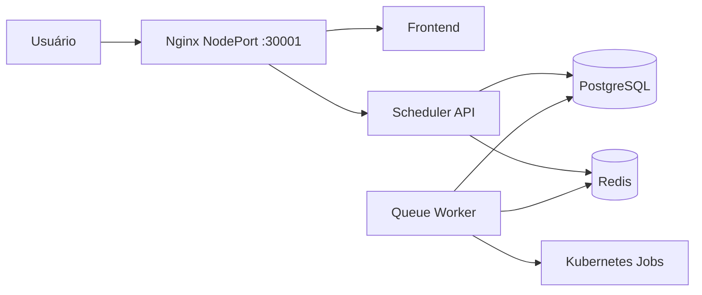

# Infraestrutura

## Desenvolvimento com Docker Compose

`eevee-infrastructure/docker-compose.yml` possui somente dois serviços:

- Redis, imagem `redis:8.6.2`, porta 6379 e volume `redis-data`;
- PostgreSQL, imagem `postgres:16`, porta externa 5433 e volume `pgdata`.

## Imagens

O Makefile raiz oferece alvos individuais para construir e enviar:

- `scheduler-api`;
- `front`;
- bootstrap;
- Node.js;
- NestJS;
- gRPC;
- Next.js/Cypress;
- React/Cypress;
- TeraORM.

O Dockerfile do frontend requer o diretório raiz como contexto:

```bash
docker build -t ghcr.io/cocsi-mg/front:develop -f front/Dockerfile .
```

A API usa seu próprio diretório como contexto:

```bash
docker build -t ghcr.io/cocsi-mg/scheduler-api:develop scheduler-api
```

## Chart Helm

O chart agregador fica em `eevee-infrastructure/helm/eevee`. Seus componentes padrão são:



O chart também permite habilitar Ingress e um Issuer do cert-manager. Por padrão, o acesso externo é feito pelo gateway Nginx em NodePort `30001`.

As imagens padrão usam `ghcr.io/cocsi-mg` e a tag `develop`. PostgreSQL e Redis podem ser instalados no próprio cluster. O chart espera Secrets pré-criados, salvo quando `secrets.create=true` é usado explicitamente em ambiente local.

## Comandos Helm existentes

O Makefile raiz fornece:

```bash
make lint
make template
make install
make status
make uninstall
```

Os valores padrão usam release `eevee`, namespace `eevee-cefetrj` e `eevee-infrastructure/helm/eevee/values.yaml`. O alvo `install` não usa `--create-namespace`; o namespace e os Secrets precisam existir antes da instalação.

!!! warning "Instruções antigas"
    O README da infraestrutura cita recursos `k8s/` e o alvo `helm-install`, mas eles não existem na estrutura atual. Os workflows de deploy também conservam referências a manifests antigos. Valide o processo de produção antes de usá-lo.