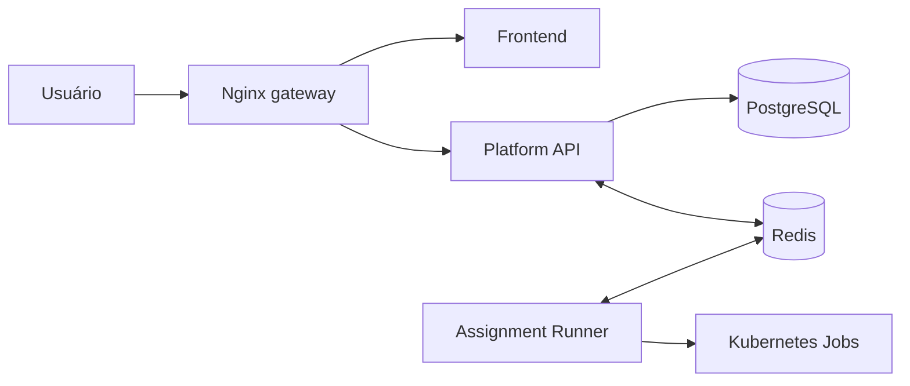

# Infraestrutura

## Desenvolvimento com Docker Compose

`infrastructure/docker-compose.yml` inicia somente:

- Redis `8.6.2`, na porta 6379, com volume `redis-data`;
- PostgreSQL `16`, na porta externa 5433, com volume `pgdata`.

Frontend, Platform API e Assignment Runner rodam como processos separados no desenvolvimento local. Os Kubernetes Jobs são criados no Minikube.

## Imagens da aplicação e dos workers

O Makefile raiz constrói e publica as imagens de `platform-api`, `assignment-runner` e `front`. O frontend e os dois serviços usam o diretório raiz como contexto para acessar o pacote compartilhado.

O catálogo de executores inclui:

| Tipo | Framework principal |
| --- | --- |
| `node_default` | Jest |
| `javascript_default` | Jest |
| `node_nestjs` | Jest |
| `node_reactjs_cypress` | Cypress |
| `node_grpcjs` | Jest |
| `node_nextjs_cypress` | Cypress |
| `node_default_postgresql` | Jest + PostgreSQL |
| `node_nestjs_postgresql` | Jest + PostgreSQL |
| `node_teraorm` | Jest + serviços auxiliares |
| `python_default` | Pytest |

`make prepare-workers` reconstrói todas as imagens em `images/`, carrega-as no Minikube e disponibiliza `postgres:16` para os workers que precisam de banco.

## Chart Helm

O chart fica em `infrastructure/helm/eevee` e instala os seguintes componentes:

O chart pode incluir PostgreSQL, Redis, gateway Nginx, Ingress e cert-manager. Há ainda recursos de proxy de saída e políticas de rede para execuções que exigem acesso controlado.

As imagens padrão usam `ghcr.io/cocsi-mg` e a tag `develop`. Secrets podem ser referenciados ou criados pelo chart, conforme os valores. O namespace padrão do Makefile é `eevee-cefetrj` e a release é `eevee`.

