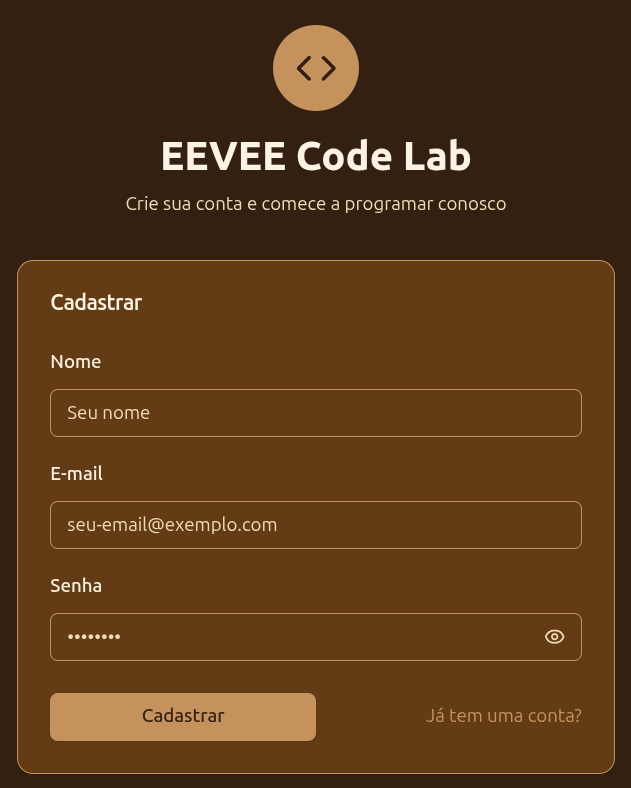
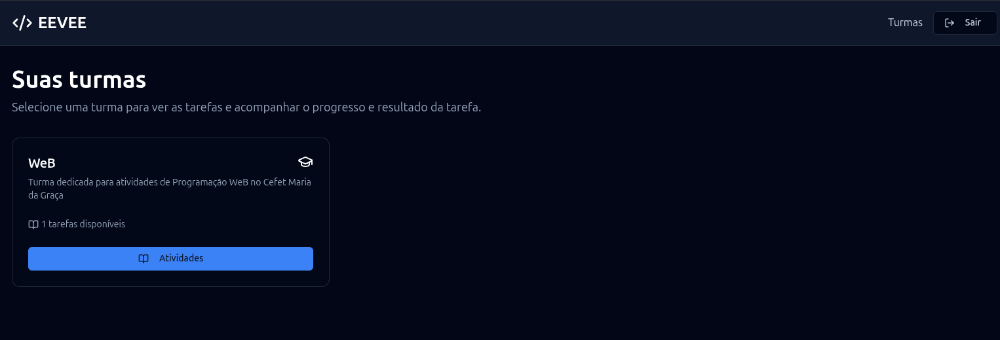
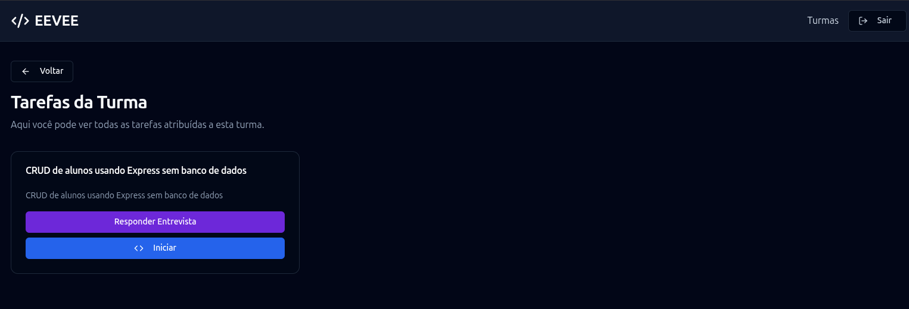

# Turmas e atividades

## Entrar como aluno

Abra o endereço do EEVEE fornecido pela instituição e informe seu e-mail e sua senha. Depois do login, uma conta de estudante é direcionada para **Suas turmas**.

Caso não possua conta, clique em **Crie uma conta** e siga as instruções. A criação de conta exige um e-mail válido.

<figure markdown="span">
  { .screenshot }
  <figcaption>Formulário de criar conta</figcaption>
</figure>

## Consultar as turmas

Cada cartão de turma mostra:

- Nome e descrição;
- Quantidade de atividades disponíveis;
- Botão **Atividades**, que abre os exercícios da turma.

Somente as turmas associadas à sua conta são listadas. Se a página informar que nenhuma turma foi encontrada, entre em contato com o professor para confirmar a matrícula.

<figure markdown="span">
  { .screenshot }
  <figcaption>Lista de turmas</figcaption>
</figure>

## Escolher entre tarefas e provas

Ao abrir uma turma, use **Tarefas** para consultar todas as atividades disponíveis ou **Provas** para consultar os agrupamentos liberados pelo professor. Provas sem data de início ou cujo horário ainda não chegou não aparecem para estudantes.

## Escolher uma atividade

Na página **Tarefas da Turma**, cada cartão apresenta o título, a descrição e as ações disponíveis. Descrições longas podem ser abertas por completo com **Ver mais**.

| Ação | Quando usar |
| --- | --- |
| **Iniciar** | Abre o workspace para desenvolver ou continuar a solução. |
| **Visualizar Resultados** | Abre o histórico quando já existe pelo menos uma tentativa. |
| **Responder Entrevista** | Abre as perguntas da atividade, o envio exige uma tentativa aceita. |
| **Gabarito** | Abre a solução de referência quando ela existe e foi liberada pelo professor. |

<figure markdown="span">
  { .screenshot }
  <figcaption>Lista de atividades</figcaption>
</figure>

## Entender os avisos do cartão

| Aviso | Significado |
| --- | --- |
| **Em execução** | A tentativa mais recente ainda está sendo processada. O botão de início fica desabilitado até a conclusão. |
| **Resultados disponíveis** | A tentativa mais recente foi concluída e pode ser consultada. |
| **Tentativa com falha** | A execução terminou com erro ou não produziu um resultado válido. |
| **Tarefa suspensa por quebra de conduta** | O número de alertas ativos atingiu o limite da atividade. Procure o professor para obter mais informações. |

!!! tip "Atualização automática"
    A lista de atividades é atualizada periodicamente. Depois de enviar uma solução, aguarde a mudança do estado antes de tentar abrir o workspace novamente.

## Continuar

- [Conhecer o workspace](workspace.md)
- [Consultar provas](exams.md)
- [Executar e enviar uma solução](submissions-and-results.md)
