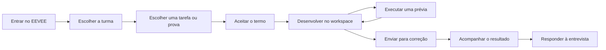

# Guia do aluno

No EEVEE, o aluno acessa as atividades das turmas em que está matriculado, desenvolve a solução no navegador e acompanha o resultado de cada tentativa.

## Visão geral do trabalho

1. **Acesso:** Entre com sua conta de estudante.
2. **Turma:** Escolha uma das turmas em que você está matriculado.
3. **Tarefa ou prova:** Escolha uma atividade diretamente ou dentro de uma prova disponível.
4. **Workspace:** Edite os arquivos fornecidos e crie outros quando necessário.
5. **Execução:** Teste a solução sem consumir uma tentativa de correção.
6. **Correção:** Envie os arquivos e aguarde o processamento.
7. **Resultado:** Consulte a pontuação, os testes aprovados e o feedback disponível.
8. **Entrevista:** Após obter uma tentativa aceita, responda às perguntas disponibilizadas.

## Antes de começar

Você precisa de:

- Uma conta de estudante;
- Matrícula em pelo menos uma turma;
- Um navegador web atualizado;
- Acesso à instalação do EEVEE informada pelo professor ou pela instituição.

!!! note "Matrícula"
    As turmas exibidas dependem da matrícula feita pelo professor. Se uma turma ou atividade esperada não aparecer, confirme sua matrícula com o responsável.

## O que o aluno encontra

| Área | Finalidade |
| --- | --- |
| Turmas | Lista as turmas associadas à conta. |
| Atividades | Mostra os exercícios, o estado da última tentativa e os acessos disponíveis. |
| Provas | Agrupa atividades da turma e mostra quantos pontos cada uma vale. |
| Workspace | Reúne enunciado, arquivos, editor e ações de execução e envio. |
| Resultados | Apresenta o histórico de tentativas, pontuação e feedback. |
| Gabarito | Exibe uma solução de referência quando o professor libera o acesso. |
| Entrevista | Registra respostas sobre a experiência após uma solução aceita. |

## Próximos passos

- [Acessar turmas e atividades](classes-and-assignments.md)
- [Consultar provas](exams.md)
- [Desenvolver no workspace](workspace.md)
- [Executar, enviar e interpretar resultados](submissions-and-results.md)
- [Responder à entrevista](interview.md)
