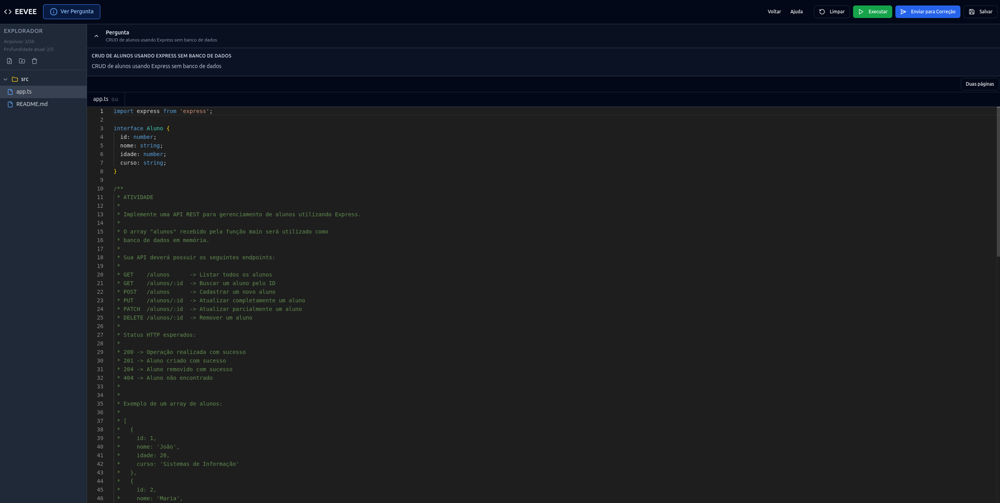

# Workspace do aluno

O workspace é o ambiente em que você lê o enunciado, organiza os arquivos e desenvolve a solução da atividade.

## Aceitar o termo de uso

No primeiro acesso à atividade neste navegador, o EEVEE apresenta as regras de conduta. Marque a confirmação de leitura e escolha **Continuar** para abrir o editor. A opção **Recusar** retorna à página anterior.

A aceitação fica registrada no navegador para aquela atividade e para a versão atual das regras. Quando o professor altera a política de alertas, o termo é apresentado novamente.

<figure markdown="span">
  { .screenshot }
  <figcaption>Termo de uso apresentado antes do início da atividade.</figcaption>
</figure>

!!! warning "Siga as regras exibidas"
    Sair da tela, abrir ferramentas de desenvolvimento, usar a área de transferência e exceder a velocidade de digitação podem ser bloqueados. O termo informa quais desses eventos contam como alerta punitivo e quantos alertas ativos bloqueiam a atividade.

## Conhecer a interface

<figure markdown="span">
  { .screenshot }
  <figcaption>Workspace com explorador de arquivos, enunciado e editor de código.</figcaption>
</figure>

O workspace reúne:

- **Pergunta:** Mostra o título e a descrição da atividade e pode ser recolhida para liberar espaço;
- **Explorador:** Lista os arquivos e pastas da solução;
- **Editor:** Abre o arquivo selecionado e identifica a linguagem pela extensão;
- **Duas páginas:** Permite visualizar e editar dois arquivos lado a lado;
- **Cabeçalho:** Concentra as ações de limpar, executar, enviar e salvar.

O botão **Ver Pergunta** abre o enunciado completo em uma janela, mesmo quando o painel de pergunta está recolhido.

## Organizar os arquivos

No explorador, você pode:

- Criar arquivos e pastas;
- Renomear ou excluir itens;
- Arrastar itens para reorganizar a árvore;
- Abrir um arquivo no segundo editor pelo menu de contexto;
- Acompanhar os contadores de arquivos e profundidade.

O workspace aceita até 50 arquivos e cinco níveis de profundidade. Preserve os arquivos e caminhos fornecidos no código inicial, pois os testes podem importá-los diretamente.

!!! danger "Limpar restaura o código inicial"
    **Limpar** substitui todo o conteúdo atual pelo boilerplate (código fornecido inicialmente) definido pelo professor . A interface pede confirmação porque essa operação descarta as alterações do workspace.

## Entender onde o trabalho fica salvo

As alterações no editor e na árvore de arquivos são mantidas automaticamente no armazenamento local do navegador, separadas por aluno e atividade. Ao voltar à atividade no mesmo navegador, o workspace recupera esse conteúdo.

O botão **Salvar** envia ao serviço de armazenamento apenas o arquivo que está selecionado. Ele não substitui o envio para correção e não representa uma cópia completa do workspace.

!!! warning "Use o mesmo navegador"
    O conteúdo automático do workspace é local. Limpar os dados do navegador ou mudar de navegador ou dispositivo pode impedir a recuperação dessa versão. Antes de encerrar o trabalho, confirme as orientações de armazenamento da sua instituição.

## Alertas e bloqueio

Cada ocorrência mostra um aviso. Quando o evento não está selecionado pelo professor, a ação continua bloqueada, mas não gera registro punitivo. Se a conexão falhar, um evento punitivo pendente é reenviado com o mesmo identificador, sem duplicar o alerta.

Ao atingir o limite de alertas ativos, o workspace exibe uma mensagem de bloqueio e oferece apenas o retorno à página anterior. O professor pode arquivar ocorrências específicas; o acesso é liberado quando a quantidade de alertas ativos fica abaixo do limite, e os registros arquivados continuam disponíveis no histórico.

## Continuar

- [Executar uma prévia e enviar para correção](submissions-and-results.md)
- [Voltar para turmas e atividades](classes-and-assignments.md)
