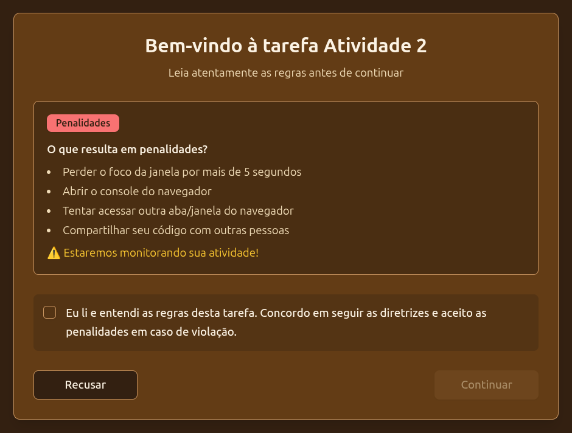
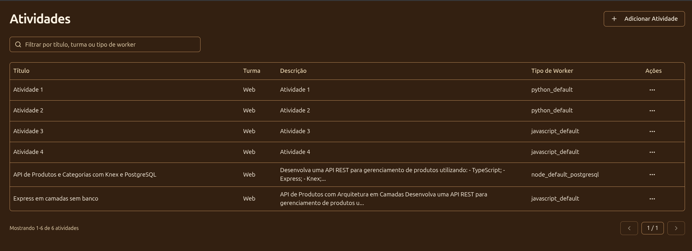
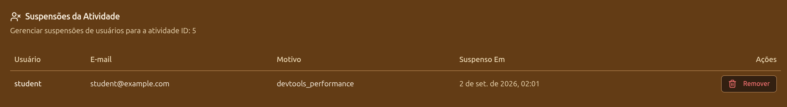
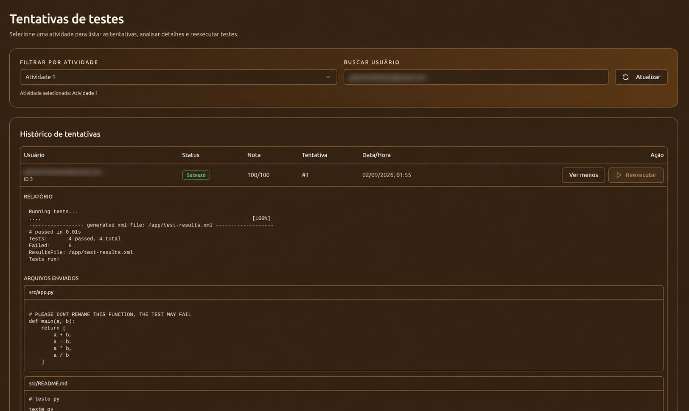

# Aplicar a atividade e interpretar resultados

## Disponibilização

Depois que a atividade é salva, os estudantes da turma podem encontrá-la na página de turmas.

Antes da aplicação, confirme:

- matrículas da turma;
- pelo menos um template compatível;
- limite de tentativas adequado;
- dependências e serviços externos, quando usados.

## Durante a atividade

O workspace mostra um termo de uso, armazena arquivos no navegador e aplica mecanismos de monitoramento no cliente. Tentativas de copiar, colar ou abrir ferramentas de desenvolvimento podem gerar suspensão automática após os limites implementados.


<figure markdown="span">
  { .screenshot }
  <figcaption>Termo de uso por atividade</figcaption>
</figure>

!!! warning "Monitoramento experimental"
    O monitoramento ocorre principalmente no frontend e pode produzir falsos positivos ou ser contornado. Caso um aluno tenha sido bloqueado de forma errada ou deseja dar uma segunda chance para ela basta consultar as suspensões dentro de atividades e remover-lo.

### Bloqueio

Para acessar os alunos bloqueados, vá até atividades e clique nos 3 pontinhos de ações para entrar em "Usuários Suspensos".

<figure markdown="span">
  { .screenshot }
  <figcaption>Usuários bloqueados por tarefa</figcaption>
</figure>

Em seguida consulte o nome do usuário correspondente na lista e remova o bloqueio dele. É possível validar também o motivo de sua suspensão.

<figure markdown="span">
  { .screenshot }
  <figcaption>Lista de usuários bloqueados</figcaption>
</figure>

## Execução prévia

Ao escolher **Executar** o registro é processado e pode ser acompanhado ou cancelado. A prévia não incrementa o número de tentativas.

## Envio para correção

Ao escolher **Enviar para Correção**, o sistema:

1. verifica a atividade, a matrícula e o limite de tentativas;
2. persiste os arquivos enviados;
3. coloca a tentativa na fila;
4. executa os testes;
5. persiste pontuação, contagens e relatório.

O consumidor da fila é um processo separado da API. Se ele não estiver em execução, a submissão é aceita pela API, mas permanece pendente.

## Estados e resultados

| Estado | Interpretação |
| --- | --- |
| `pending` / `enqueded` | Registrada e aguardando processamento. |
| `running` | O consumidor iniciou o processamento. |
| `completed` | Execução encerrada e resultado persistido. |
| `failed` | Erro de preparação, infraestrutura, testes ausentes ou execução. |

A pontuação é calculada por:

```text
testes aprovados / (testes aprovados + testes reprovados)
```

Uma pontuação de `0.75` corresponde a 75%. `isAcceptable` é verdadeiro a partir de `0.7`.

O relatório bruto contém a saída tratada do executor. Erros de infraestrutura podem aparecer junto de mensagens do framework de testes, avalie o relatório antes de interpretar toda falha como erro do estudante.

## Acompanhamento administrativo

Em **Tentativas**, o administrador seleciona uma atividade, filtra por estudante e expande cada registro para ver:

- estado, nota e contagens;
- relatório bruto;
- arquivos recebidos;
- dados da tentativa.

A ação administrativa de reexecução usa os arquivos armazenados e cria **uma nova tentativa** para o estudante. Ela não altera a tentativa anterior e não aplica o limite máximo ao administrador.

<figure markdown="span">
  { .screenshot }
  <figcaption>Lista de tentativas de execução detalhada</figcaption>
</figure>
