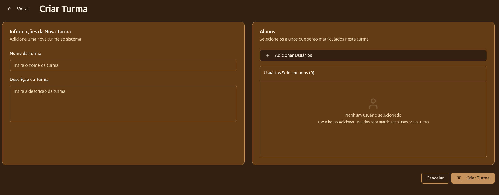
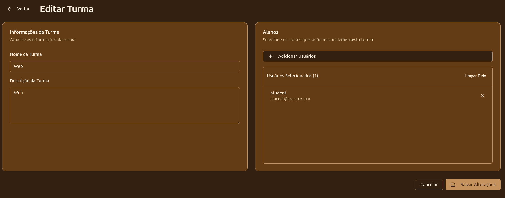

# Turmas e usuários

## Criar uma turma

Na área administrativa, abra **Turmas** e crie uma nova turma. O formulário trabalha com:

- nome;
- descrição;
- lista de estudantes.

!!! warning "Adicionar aluno"
    É necessário adicionar **pelo menos uma conta de estudante** antes de salvar a turma.

<figure markdown="span">
  { .screenshot }
  <figcaption>Formulário utilizado para criar uma nova turma.</figcaption>
</figure>

## Matrícula e visibilidade

Ao editar uma turma, o serviço substitui sua lista de estudantes pela seleção enviada. Remover um estudante da lista retira sua associação com a turma.

Com isso, esse aluno para de conseguir visualizar e responder as atividades propostas.

<figure markdown="span">
  { .screenshot }
  <figcaption>Formulário utilizado para editar uma turma.</figcaption>
</figure>
