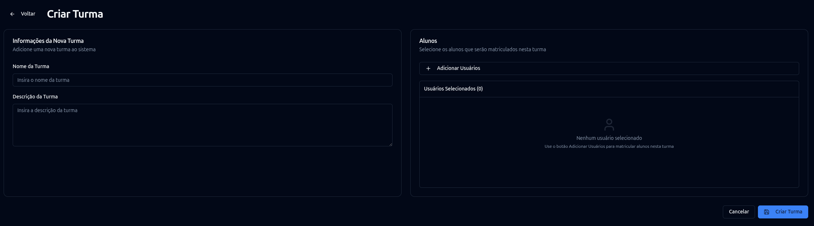
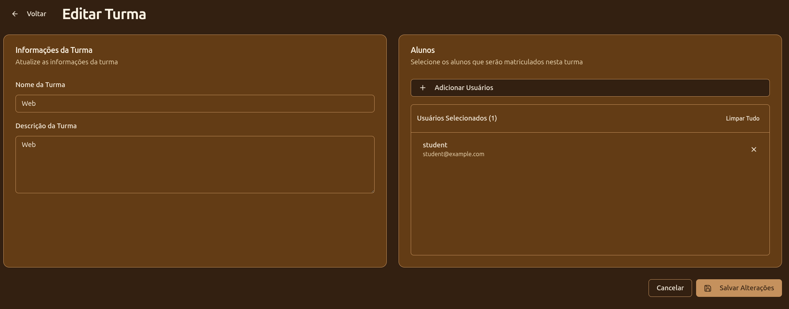

# Turmas e usuários

## Gerenciar usuários

Na área administrativa, abra **Usuários** para pesquisar contas por nome ou e-mail. A lista apresenta o papel de cada pessoa e oferece ações de edição e desativação. O cadastro público cria uma conta de aluno, para habilitar um professor, o admin altera o papel dessa conta.

Ao criar uma conta administrativa, informe:

- nome;
- e-mail;
- senha com pelo menos oito caracteres;
- se a conta terá papel de administrador.

Ao editar, é possível alterar nome, e-mail e papel. Deixe a senha vazia para preservar a senha atual ou informe uma nova senha para redefini-la.

!!! warning "Desativação"
    Desativar uma conta remove seu acesso imediatamente e revoga suas sessões. Os registros históricos são preservados.

## Criar uma turma

Abra **Turmas** e crie uma nova turma. Uma turma criada por um professor fica sob a responsabilidade dele, admins podem selecionar ou trocar o professor responsável. A permissão acompanha o responsável atual: após a troca, o professor anterior perde acesso e o novo responsável passa a gerenciar a turma. Professores veem e administram somente suas próprias turmas. O formulário trabalha com:

- nome;
- descrição;
- lista de estudantes (admins e o professor responsável podem gerenciar matrículas; alunos não veem a lista de colegas).

!!! warning "Adicionar aluno"
    O admin pode exigir ao menos um estudante ao criar a turma. O professor pode criar uma turma sem matrículas e adicioná-las depois.

<figure markdown="span">
  { .screenshot }
  <figcaption>Formulário utilizado para criar uma nova turma.</figcaption>
</figure>

## Matrícula e visibilidade

Ao editar uma turma, o serviço substitui sua lista de estudantes pela seleção enviada. Remover um estudante retira sua matrícula e impede que ele consulte as atividades e provas daquela turma. Alunos veem somente suas próprias turmas e atividades já disponíveis.

Essa remoção não apaga a conta nem os registros históricos do estudante.

## Arquivar e restaurar

Professores podem arquivar as próprias turmas, admins podem arquivar qualquer turma. O arquivamento oculta a turma dos alunos e das listas ativas, mas preserva matrículas, atividades, provas, tentativas, templates e arquivos. Somente admins podem listar turmas arquivadas e restaurá-las.

<figure markdown="span">
  { .screenshot }
  <figcaption>Formulário utilizado para editar uma turma.</figcaption>
</figure>

## Continuar

- [Criar templates e testes](templates-and-tests.md)
- [Criar uma atividade](assignments.md)
- [Organizar provas e notas](exams.md)
