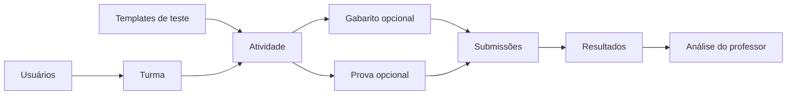
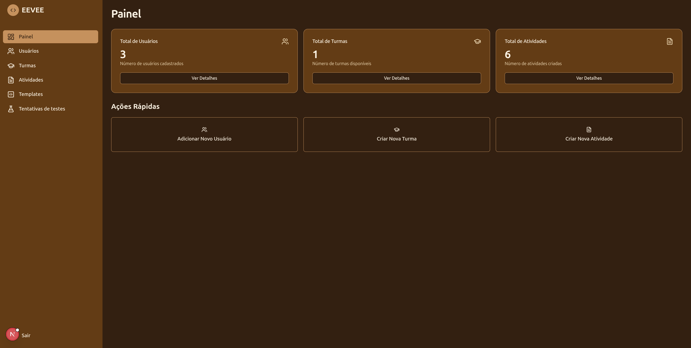

# Guia do professor

No EEVEE, as operações de professor reúnem usuários, turmas, templates, atividades, gabaritos, provas e tentativas.

## Visão geral do trabalho

1. **Usuários:** cadastre os estudantes na turma.
2. **Turma:** informe nome e descrição e selecione os estudantes.
3. **Templates:** escreva os testes, defina seus parâmetros e dependências.
4. **Atividade:** escolha a turma, o executor, os templates, o código inicial e o limite de tentativas.
5. **Gabarito:** prepare e teste uma solução de referência antes de liberá-la.
6. **Prova:** agrupe atividades e defina quantos pontos cada uma vale.
7. **Acompanhamento:** consulte as tentativas e as notas por estudante.

## O que o professor configura

O professor controla os artefatos da avaliação, mas o modelo atual tem algumas fronteiras:

| Recurso | Comportamento confirmado |
| --- | --- |
| Turma | Agrupa estudantes e atividades. |
| Atividade | Corresponde a um exercício de programação. |
| Template | Contém um teste automatizado reutilizável. |
| Gabarito | Armazena a solução de referência de uma atividade. |
| Prova | Agrupa atividades da mesma turma e calcula notas por pontos. |
| Tentativas | A atividade define o máximo permitido para o estudante. |
| Disponibilidade | A atividade aparece ao ser associada e salva na turma. |

!!! tip "Prepare primeiro os testes"
    Criar e validar os templates antes da atividade reduz o risco de disponibilizar um exercício que sempre falha. A interface oferece uma prévia administrativa para executar um template contra uma solução de exemplo.

## Próximos passos

- [Organizar turmas e usuários](classes-and-users.md)
- [Criar templates e testes automatizados](templates-and-tests.md)
- [Criar uma atividade](assignments.md)
- [Criar e liberar gabaritos](answer-keys.md)
- [Organizar provas e notas](exams.md)
- [Acompanhar e interpretar resultados](application-and-results.md)
- [Teste da aplicação](application-testing.md)
