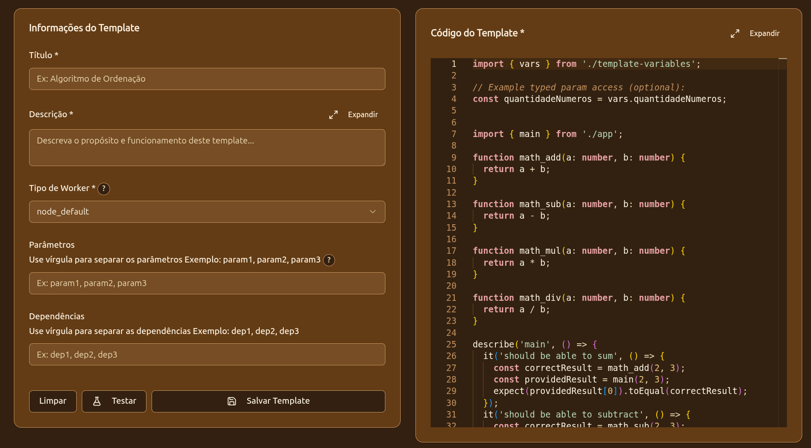
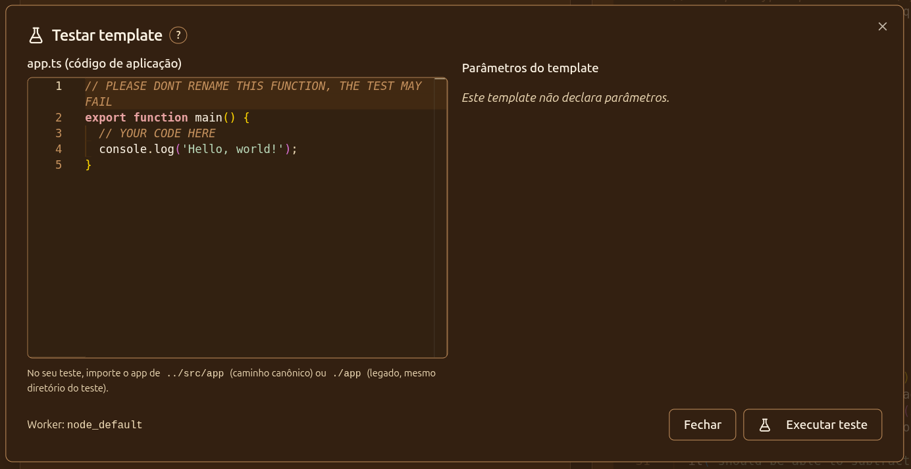

# Templates e testes automatizados

Um template é um teste executável que pode ser reutilizado em mais de uma atividade. Ele não representa uma questão de entrada e saída. Seu conteúdo é um código utilizando a biblioteca referente a linguagem em execução.

## Campos do template

| Campo | Finalidade |
| --- | --- |
| Título | Identifica o teste. |
| Descrição | Explica o comportamento verificado. |
| Worker (Executor) | Determina a imagem e a estratégia de execução. |
| Código do Template | Código do teste automatizado. |
| Parâmetros | Valores substituíveis definidos posteriormente na atividade. |
| Dependências | Pacotes npm adicionais instalados no worker. |

Os tipos de parâmetro são `STRING`, `NUMBER`, `BOOLEAN` e `OBJECT`. E podem ser passados ao associar o template com uma atividade.

<figure markdown="span">
  { .screenshot }
  <figcaption>Formulário utilizado para criar um novo tempalte.</figcaption>
</figure>

## Escolher o executor

Abaixo é a listagem dos tipos internos de executores que temos e os testes que estão presentes nele.

| Tipo interno | Testes | Uso esperado |
| --- | --- | --- |
| `node_default` | Jest | Projeto Node.js comum. |
| `node_nestjs` | Jest | Aplicação NestJS. |
| `node_grpcjs` | Jest | Serviço gRPC em Node.js. |
| `node_nextjs_cypress` | Cypress | Interface Next.js. |
| `node_reactjs_cypress` | Cypress | Interface React. |
| `node_default_postgresql` | Jest | Node.js com PostgreSQL temporário. |
| `node_nestjs_postgresql` | Jest | NestJS com PostgreSQL temporário. |

## Escrever o teste

O teste deve importar os arquivos esperados da solução. O backend normaliza caminhos relativos para a organização usada no contêiner. Consulte os exemplos sugeridos pela própria interface ao criar o template e use o Monaco Editor para editar o conteúdo.

Algumas palavras reservadas são utilizadas para buscar itens dentro dos arquivos de teste, por exemplo `import { vars } from './template-variables';` é usado quando se deseja buscar uma variável posta por parâmetro como explicado no item anterior.

Exemplo conceitual de Jest:

```typescript
import { vars } from './template-variables';

const quantidadeNumeros = vars.quantidadeNumeros;


import { main } from './app';

function math_add(a: number, b: number) {
  return a + b;
}

function math_sub(a: number, b: number) {
  return a - b;
}

function math_mul(a: number, b: number) {
  return a * b;
}

function math_div(a: number, b: number) {
  return a / b;
}

describe('main', () => {
  it('should be able to sum', () => {
    const correctResult = math_add(2, 3);
    const providedResult = main(2, 3);
    expect(providedResult[0]).toEqual(correctResult);
  });
  it('should be able to subtract', () => {
    const correctResult = math_sub(2, 3);
    const providedResult = main(2, 3);
    expect(providedResult[1]).toEqual(correctResult);
  });
  it('should be able to multiply', () => {
    const correctResult = math_mul(2, 3);
    const providedResult = main(2, 3);
    expect(providedResult[2]).toEqual(correctResult);
  });
  it('should be able to divide', () => {
    const correctResult = math_div(2, 3);
    const providedResult = main(2, 3);
    expect(providedResult[3]).toEqual(correctResult);
  });
});

describe('template vars', () => {
  it('loads generated variables module', () => {
    expect(vars).toBeDefined();
  });

  it('optional typed param has an expected type', () => {
    const ok =
      typeof quantidadeNumeros === 'undefined' ||
      typeof quantidadeNumeros === 'number';
    expect(ok).toBe(true);
  });
});

```

!!! note "Exemplo ilustrativo"
    O formato do import e a assinatura da função precisam corresponder a atividade. O exemplo acima demonstra a estrutura, não uma API obrigatória para todos os executores.

## Testar antes de salvar

Essa prévia cria e aguarda diretamente um worker Kubernetes. Ela não cria uma tentativa de estudante.

Para testar clique em "Testar" dentro da atividade e coloque o código correspondente.

<figure markdown="span">
  { .screenshot }
  <figcaption>Teste utilizado para validar um tempalte.</figcaption>
</figure>

## Dependências e cuidados

As dependências declaradas são instaladas com npm dentro do worker. Use somente os pacotes necessários, fixe versões quando a reprodutibilidade for importante e considere que a instalação demanda rede. O sistema atual não duplica dependências vindas de templates diferentes.
